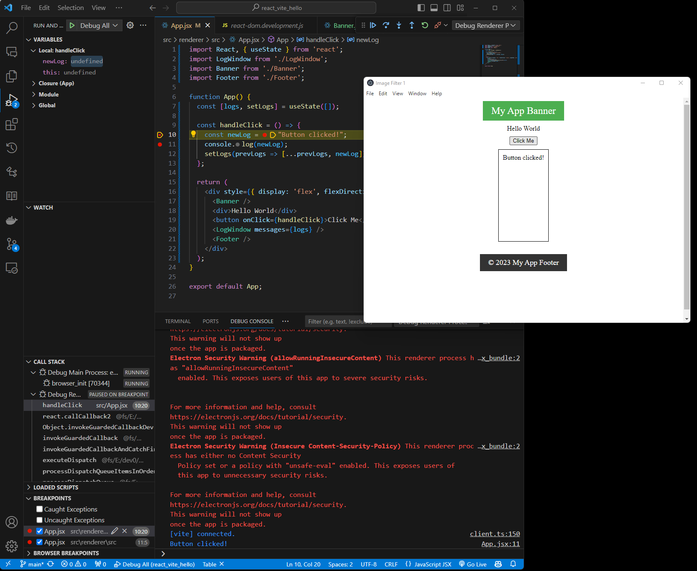

# Electron + React + Vite + JavaScript Starter

This is a template for building Electron apps with React and Vite. It's based on [Brian De Sousa's Build an Electron app with electron-vite](https://blog.logrocket.com/build-electron-app-electron-vite/)

* Features
    1. React
    2. Vite
    3. JavaScript
    4. Electron
    5. VS Code debugging
    
## Getting Started

Clone this repository locally :

```bash
git clone git@github.com:datajango/react_vite_js_starter.git "your app name goes here"
``` 

Install dependencies with npm :

```bash
npm install
```

Start development server :

```bash
npm run dev
```

## Debugging

Using VSCode, you can debug the main process by pressing `F5` or by clicking on the `Run and Debug` icon on the left sidebar and selecting `"Debug All"`.

Here I have set a break-point in the `App.jsx` file and VSCode stopped at the break-point.
